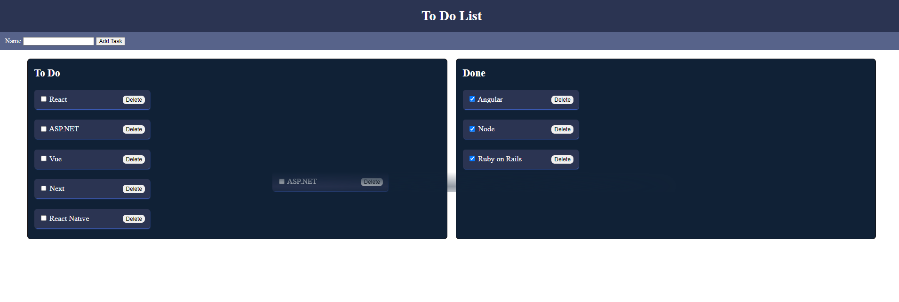

# README To-Do List Tutorial Project
## Description

This README would normally document whatever steps are necessary to get the
application up and running.

This is a Ruby on Rails project using SQLite3 as the database.

This implements the drag-and-drop functionality from the To-Do list to the Done list.

* Ruby version
    * Rails 7.2.1
* System dependencies
    * windows
* Database creation
    * SQLite3
## Getting Started
1. Clone the repository
    ```
    git clone https://github.com/bjmmtin/ToDoList.git
2. Run migrations:
    ```
    rails db:migrate
3. Run the application:
    ```
    rails s


